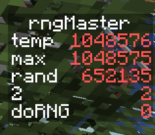

# Description
This project is used to interact between Python and Java Minecraft servers using its integrated RCON connection. It includes an interface to run Minecraft commands, get/modify Storage data, and get/set scoreboard values. 

The backend uses solely Minecraft commands to perform its actions, harvesting the required data from the commands' textual output.

_The proof_of_concept directory contains a datapack and Python loop that counts incoming items of a hopper and calculates the rate of items per second. This data is then formatted and displayed to the players, including fun colouring depending on the item._

_I won't give a tutorial on how to use it, but feel free to message me at my [Reddit account](https://www.reddit.com/user/FancyPotatOS) if you're interested in seeing it in action._

<br>

# Citation
## relaxedjson.py (relaxedjson/*)
https://github.com/simon-engledew/relaxedjson.py

## rcon (rcon/*)
https://pypi.org/project/rcon/

<br>

# Sample code

### Create the connection
```
client = MinecraftRCon('localhost', 25566, 'password')
```

### Run a command using the connection
```
client.run("give @a minecraft:diamond")
```


## Storage

### Initialize storage class using the connection
```
storage = client.get_storage("blah")
```

### Get the storage's NBT (This returns in JSON)
```
storage.get()
```

### Set some storage information
```
storage.merge('{tellme:[{"text":""},{"text":"VALUE","color":"red"}]}')
```


## Scoreboards

**The sample's scoreboard values:**



### Initalize scoreboard class using the connection
```
scoreboard = client.get_scoreboard("rngMaster")
```

### Get a player's value
```
scoreboard.get("temp") 
```
_returns: 1048576_

```
scoreboard.get("rand") 
```
_returns: 652135_

### Perform a scoreboard operation on a player's value
```
scoreboard.operation("@p", "=", "@e[type=zombie,limit=1]", "rngDyn")
```
_Equivalent Minecraft command:_
```
scoreboard players operation @p rngMaster = @e[type=zombie,limit=1] rngDyn
```